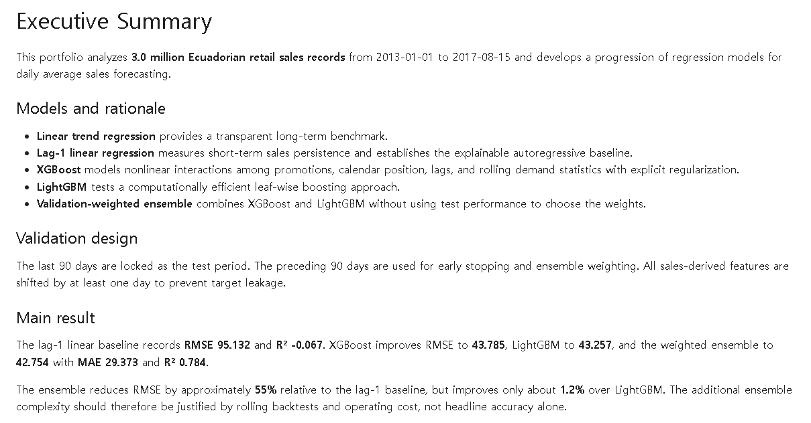
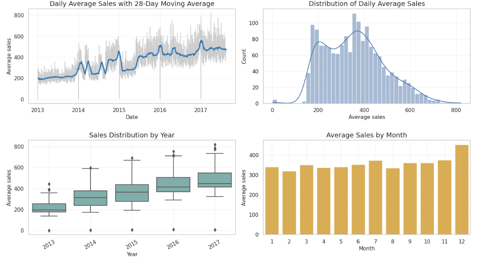
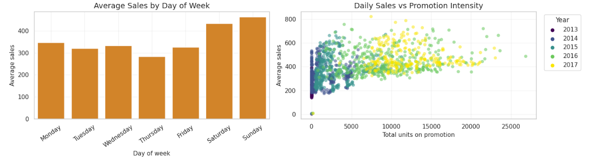
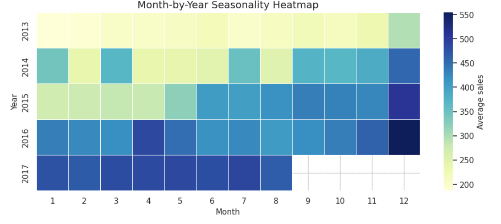
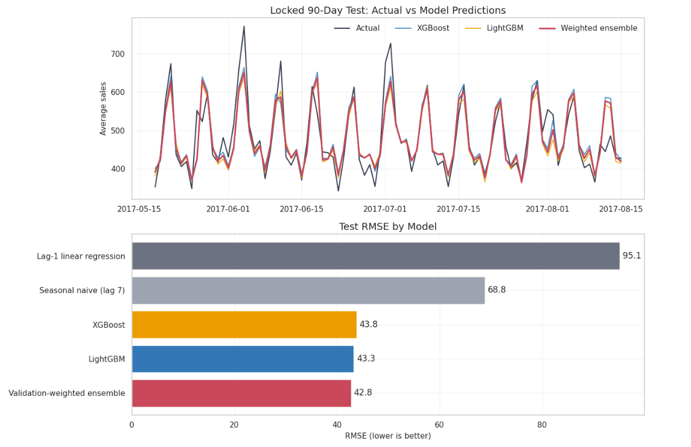
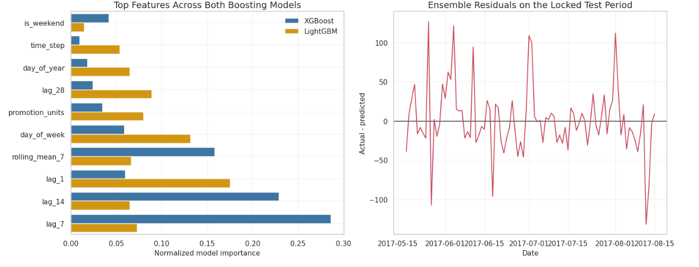
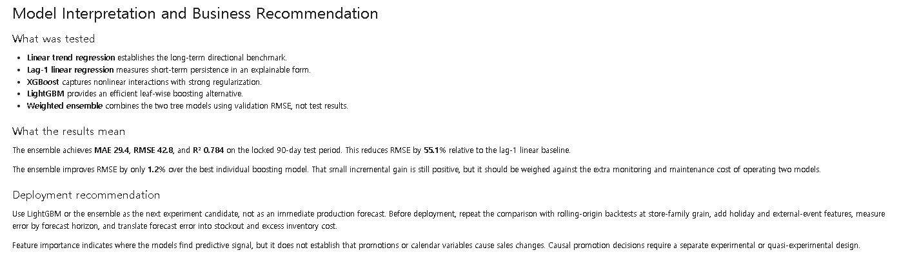

# Retail Demand Forecasting with Time-Aware Regression

An end-to-end forecasting study using 3.0 million store-sales records from Ecuador. The analysis starts with transparent regression baselines, then tests whether gradient boosting and a validation-weighted ensemble deliver enough out-of-sample improvement to justify their added complexity.

> **Result:** On a locked 90-day test period, the ensemble achieved **MAE 29.4**, **RMSE 42.8**, and **R² 0.784**. This reduced RMSE by **55.1%** relative to the lag-1 linear baseline, but improved only **1.2%** over LightGBM.

[Open the reproducible notebook](notebooks/retail_demand_forecasting.ipynb)



## Business question

Retail forecasts affect inventory allocation, staffing, and promotion planning. This study asks two practical questions:

1. How much predictive value is available in trend, seasonality, promotion exposure, and recent sales history?
2. Does a two-model ensemble improve enough over a strong single model to justify additional operational cost?

The target is daily average sales across stores and product families. That level is appropriate for studying company-wide demand patterns; it is not presented as a store-level replenishment model.

## Data

- **Source:** [Store Sales - Time Series Forecasting](https://www.kaggle.com/competitions/store-sales-time-series-forecasting)
- **Coverage:** 2013-01-01 to 2017-08-15
- **Raw observations:** 3,000,888
- **Daily target observations:** 1,684
- **Target:** mean daily sales across store-family records

The competition data is not redistributed in this repository. The notebook expects the original Kaggle dataset.

## Analytical approach


### 1. Validate the demand signal

The first pass checks source coverage, target plausibility, and structural changes over time. Daily sales rise materially across the observation window, while the distribution remains right-skewed and contains occasional extreme days.



Weekend demand is visibly higher, and promotion exposure is associated with higher sales levels. The scatter also shows that promotion alone is not enough to explain demand variation.



The month-by-year view shows that seasonality is not stationary: calendar effects sit on top of a changing demand level.



### 2. Build features without future leakage

Features are limited to information available before, or known for, the prediction date:

- calendar position: year, month, day of year, day of week, weekend flag
- planned promotion volume for the sales date
- sales lags: 1, 7, 14, and 28 days
- shifted rolling mean and standard deviation: 7, 14, and 28 days

Every sales-derived rolling feature is shifted by one day before aggregation. The current target is never included in its own predictors.

### 3. Preserve time order during validation

Random train-test splitting would allow future demand regimes to influence model selection. The data is therefore separated chronologically:

| Split | Period | Observations | Purpose |
|---|---|---:|---|
| Train | 2013-01-29 to 2017-02-16 | 1,476 | Parameter estimation |
| Validation | 2017-02-17 to 2017-05-17 | 90 | Early stopping and ensemble weights |
| Test | 2017-05-18 to 2017-08-15 | 90 | Final comparison only |

The test period remains untouched until the model specification and ensemble rule are fixed.

## Models

| Model | Why it is included |
|---|---|
| Linear trend | Transparent long-run benchmark |
| Lag-1 linear regression | Explainable measure of short-term persistence |
| Seasonal naive, lag 7 | Strong low-cost benchmark for weekly retail seasonality |
| XGBoost | Regularized nonlinear interactions across correlated lag features |
| LightGBM | Efficient leaf-wise boosting for threshold effects |
| Validation-weighted ensemble | Tests whether combining the two tree models reduces generalization error |

XGBoost and LightGBM use conservative learning rates, regularization, row and column sampling, and early stopping. After the number of trees is selected on validation data, each model is refit on all pre-test observations.

Ensemble weights are proportional to inverse validation RMSE:

```text
XGBoost weight  = 0.508
LightGBM weight = 0.492
```

## Out-of-sample results

| Model | MAE | RMSE | R² |
|---|---:|---:|---:|
| Validation-weighted ensemble | **29.373** | **42.754** | **0.784** |
| LightGBM | 29.448 | 43.257 | 0.779 |
| XGBoost | 30.604 | 43.785 | 0.774 |
| Seasonal naive, lag 7 | 52.713 | 68.819 | 0.442 |
| Lag-1 linear regression | 78.630 | 95.132 | -0.067 |



The tree models capture the weekly peaks far better than either linear or seasonal-naive baselines. The ensemble is the top-scoring model, but its margin over LightGBM is small. Accuracy alone is therefore not a sufficient reason to operate two models.

## Model interpretation

Lagged sales dominate both boosting models, particularly the 7- and 14-day signals. Day of week, recent rolling demand, promotion volume, and calendar position provide additional information.



Built-in tree importance is used here for model inspection, not causal inference. Promotion importance does not establish that promotions caused the observed sales lift. A causal promotion decision would require an experiment or a credible quasi-experimental design.

Residual spikes remain around several high-demand dates. These misses point to omitted holiday, event, and local store-family effects rather than a need for indiscriminate parameter tuning.

## Recommendation

LightGBM is the cleaner operating candidate unless rolling backtests show that the ensemble's small average improvement is stable across time, stores, product families, and forecast horizons. The next modeling step should move from company-level daily averages to `date × store × product_family`, add holiday and event information, and evaluate error in inventory-cost terms.



## Limitations

- Aggregation hides store and product-family heterogeneity.
- One locked test window is not a substitute for rolling-origin backtesting.
- Same-day promotion volume is treated as known because promotions are planned in advance; that assumption must be checked in a production data pipeline.
- Built-in feature importance is model-specific and non-causal.
- No stockout or inventory-cost labels are available, so MAE and RMSE remain proxy objectives.

## Repository structure

```text
.
├── assets/                         # Selected analysis figures
├── notebooks/
│   └── retail_demand_forecasting.ipynb
├── src/
│   └── retail_forecasting.py       # Reusable feature and model pipeline
├── tests/
│   └── test_pipeline.py             # Temporal split and leakage checks
├── requirements.txt
└── README.md
```

## Reproduce the analysis

1. Download the competition data from Kaggle.
2. Place `train.csv` under `input/store-sales-time-series-forecasting/`, or run the notebook on Kaggle with the competition data attached.
3. Install dependencies and run the pipeline.

```bash
python -m pip install -r requirements.txt
python src/retail_forecasting.py --data-dir input/store-sales-time-series-forecasting
```

Generated metrics and predictions are written to `outputs/`.

## 日本語サマリー

本分析では、時系列の順序を維持した学習・検証・テスト分割を採用し、将来情報のリークを防止しています。最終90日間のテスト期間において、加重アンサンブルは RMSE 42.8、R² 0.784 を達成し、Lag-1 線形回帰より RMSE を55.1%改善しました。

一方、LightGBM単体との差は約1.2%にとどまります。そのため、精度だけでなく、運用・監視・再学習コストを含めてモデルを選択する必要があります。実運用に向けた次の課題は、店舗・商品カテゴリ単位への粒度拡張、ローリング検証、休日・イベント特徴量の追加、在庫コストに基づく評価です。

## Technical stack

Python · pandas · NumPy · scikit-learn · XGBoost · LightGBM · Matplotlib · Seaborn

## License

Code in this repository is available under the MIT License. The source data remains subject to the Kaggle competition rules.
